# Portfolio

In this repository you are able to get a rough overview of my background and journey as a software developer.

Most projects linked in this repository are old game jam and "just for fun" projects that are no longer maintained but were among my first game development projects, a small time capsule from the beginning of my development journey.

---

# About me

I am Feli, an experienced software developer and **Engineering Lead** at **Forgotten Empires**.

My programming journey began ~20 years ago at the age of 8, when I started modding *Neverwinter Nights*. This early passion for programming continued to grow, eventually leading me to a career in software development. My first professional role was at **Magna Telemotive** in the automotive industry, where I spent several years before transitioning to **Usaneers**, an XR prototyping company. After a pivotal year there, I successfully moved into the games industry, joining **Forgotten Empires**, where I now serve as an **Engineering Lead**.

A core principle of mine is continuous learning and growth both for myself but also for those around me. I actively **mentor and guide** both my direct team and developers across other disciplines, helping them expand their skills and deliver high-quality work.

**Programming languages, tools, and skills:**
- C++ (embedded and game development)
- C# (specialized in Unity3D development)
- Python (tooling and automation)
- Lua (tooling)
- Java/Groovy (CI pipeline development)
- Git, Perforce (P4)
- Jira/Confluence
- Agile development and project management
- Certified Professional Scrum Developer I
- Clean code
- AUTOSAR/MISTRA

---

# My current work

As **Engineering Lead**, I provide **team leadership** by coordinating tasks, facilitating communication, and supporting performance and delivery. I prepare onboarding materials and guide team members to foster their individual and collective growth.

I engage in discussions with prospective clients, preparing pitches and milestone presentations that effectively communicate technical specifics to both technical and non-technical stakeholders.

I drive **project estimation, risk management, and decision-making** in collaboration with production, discipline leads, and other departments to align on project vision, progress, and the rapid removal of impediments.

I establish **coding standards and best practices**, conduct code reviews, and ensure technical excellence while maintaining a motivating work environment. For new projects, I design the **technical architecture** of game systems, make high-level design decisions, and troubleshoot complex technical roadblocks while working alongside the engineering team to inspire and guide them.

My role extends beyond the programming team: I hold **technical responsibility** for all developers on a project, regardless of discipline, ensuring everything is functional, well-documented, and meets their needs.

---

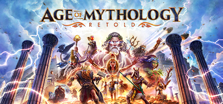

## Age of Mythology: Retold
### Released September 2024  
[*Age of Mythology: Retold*](https://store.steampowered.com/app/1934680/Age_of_Mythology_Retold/ "Age of Mythology: Retold")

Developed gameplay systems, UI components, and pathfinding in C++ using the proprietary **BANG!** engine. 

Focused heavily on bug fixing and the final push before launch to reduce bugs, desyncs, and improve overall stability. 

Created OOS (Out-of-Sync) detection and tooling in Python to ensure multiplayer stability. 

Used Azure DevOps (ADO) and Perforce for version control. 

Collaborated across disciplines to deliver a polished and performant experience.

---

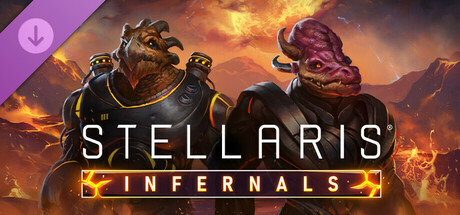

## Stellaris: Infernals Species Pack
### Released November 2025  
[Infernals Species Pack](https://store.steampowered.com/app/3283220/Stellaris_Infernals_Species_Pack/ "Infernals Species Pack")

Led a **core programming team** and served as **technical lead** for ~20 cross-discipline developers. 

Developed in **C++** using the proprietary **Clausewitz engine** while maintaining clear communication with stakeholders to meet and exceed all expectations. 

Created **Git guides** and **onboarding materials** to streamline team integration. 

Managed the **release process** and **post-launch support**.

---

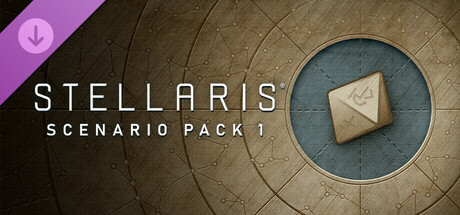

## Stellaris: Scenarios Pack
### Coming soon  

[Stellaris: Scenario Pack 1](https://store.steampowered.com/app/4241450/Stellaris_Scenario_Pack_1/ "Stellaris: Scenario Pack 1") and [*Stellaris: Scenario Pack 2*](https://store.steampowered.com/app/4355700/Stellaris_Scenario_Pack_2/ "Stellaris: Scenario Pack 2")

Leading a **larger programming team** and defining the **technical architecture** and **system concepts** for the project inside **Paradox's Clausewitz engine**. 

Integrating **new complex modding and additional content systems** into the existing codebase without breaking existing functionality. 

Coordinating **cross-discipline efforts**, especially during pre-production, and managed **stakeholder relationships**.

---
## Stellaris: Additional Support

Contributed as part of the **additional support team** for the *Stellaris Nomads* and *Biogenesis* expansions, focusing on **bug fixing** and leveraging experience with **legacy codebases** to ensure stable launches. 

Led **performance improvement efforts** that achieved a **10% reduction in frame time** across all cases through **string optimizations**.

---
## Unannounced Project

Currently leading a **small team of senior programmers** specializing in **optimization and rendering** for a project facing performance challenges. 

Managing **stakeholder relationships** while removing impediments for the engineering team, and maintaining high work quality. 

Reviewing **proposed performance changes** and **pitch solutions** tailored to both technical and non-technical audiences.

---
# My time before game development

## Automotive Industry
### Magna Telemotive GmbH

Developed **Instrument Cluster Human-Machine-Interface (IC HMI) software** in embedded **C++** according to **MISRA** and **AUTOSAR** standards. 

Established a code quality focused review process to adhere to the required guidelines. 

Handled **specification and requirements engineering** using IBM Doors. 

Implemented **automated testing** with Google Test (gtest). 

Worked in **agile environments**, earning my **Professional Scrum Developer I** certification. 

Resolved complex **bugs** across multiple systems and quickly adapted to **different projects and codebases**. 

Developed **tooling** in Python, Lua, and Groovy, as well as **prototypes** in Unity using C#. 

Managed workflows using **Jira, Confluence**, and **Git**, including an in-house **Jira** certification.

Bridged **SVN** and **Git** workflows to maintain smooth collaboration across teams with a combined size of around 100 programmers.

---
## XR Development
### Usaneers GmbH

Developed **Android and iOS applications** in **Unity** using an in-house MVVM-based framework in **C#**, including the company's first game, [*Weltensammler AR*](https://www.hugendubel.de/de/category/95701/ar_game.html "Weltensammler AR"). 

Created **AR and VR applications** for virtual training in medicine and industry like [*RemAid*](https://www.remaid.io "RemAid") using **Unity** and **C#**, deployed on **Varjo XR glasses, HoloLens, and NReal**. 

Delivered **rapid prototypes** for XR showcases at trade fairs using **Git**.

---

# (Old) Game Jam Projects

[Here](https://github.com/Niodith/Portfolio/tree/master/GameBuilds "Game builds") you can find the last running builds of mainly Game Jam projects which were made in collaboration with artists and other programmers.
The [GameJams](https://www.semestergamejam.de/events/previous-events/ "GameJams") were roundabout 100 participants in 20 - 30 teams.

### Ered Engrin
#### 3. Place Theme: Discovery
[Ered Engrin](https://github.com/Niodith/Portfolio/tree/master/GameBuilds/EredEngrin.zip "Ered Engrin") was without a doubt the most successful Game Jam Game I have been part of.
I was responsible for the main concept of the game, the title (which translated to "Iron Mountain" in Sindarin), the ice shader and the sound design as well as the last minute bug fixing.
The whole game is more based on a well-rounded overall experience than fancy game mechanics - the way the sound and the design interlock with each other gives a mysterious and slightly threatening feeling. 

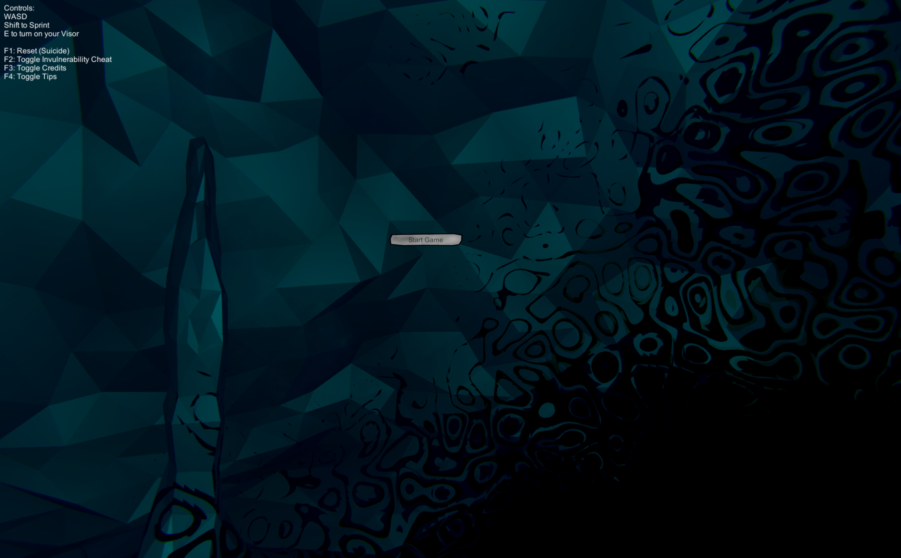
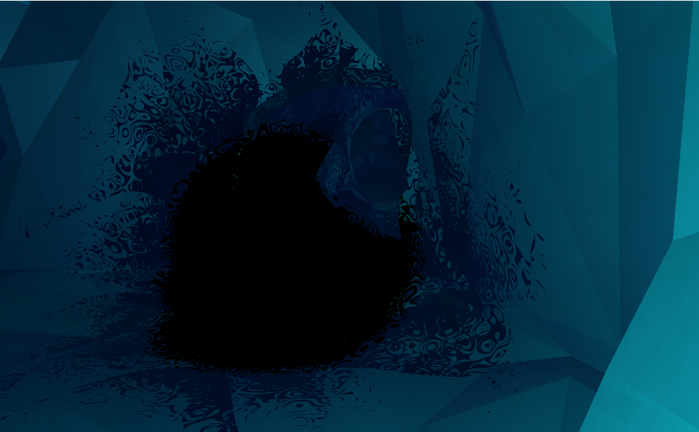
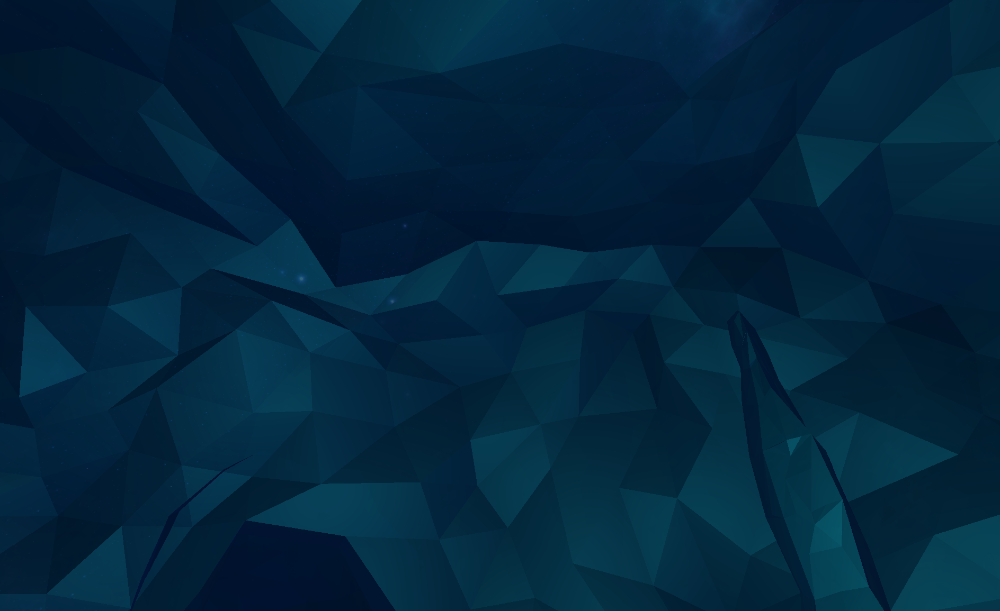

### Galactinder - The first Game Jam Dating Sim
#### Theme: Attraction - taken way to literally

Totally coincidence that this game shares part of its name with a well known dating app - _well_ it is a dating app - but on intergalactic level!
With an intuitive UI you are able to choose your prefered type of alien - and get one of 36000 procedurally generated matches.
I was responsible for the basic concept and the implementation of the UI and rendering of the procedurally generated aliens.
You can find the build of Galactinder [here](https://github.com/Niodith/Portfolio/blob/master/GameBuilds/Galactinder.zip "here").

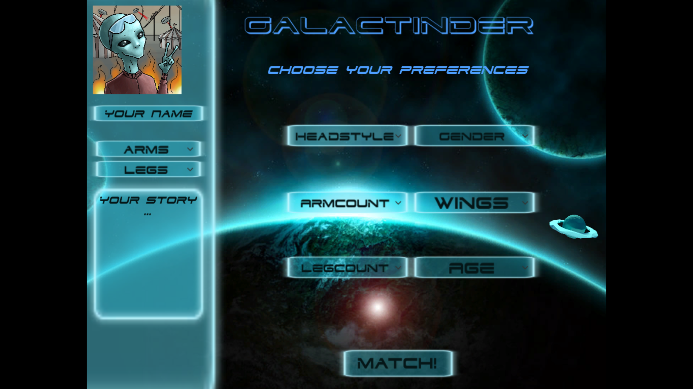
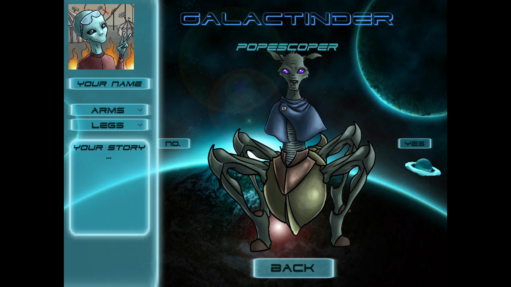

### Brainfuck Planet
#### 3. Place - Theme: Depth

Brainfuck Planet is a platformer with a high atmospheric value - the artists design interplays with sound and enemy design. I was part of the overall design, the sound and last minute bug fixing as well as for the naming (I can't believe people trusted me with naming things again after _this_).

Sadly I have no running build anymore because it requires a very old unity version (9+ years).

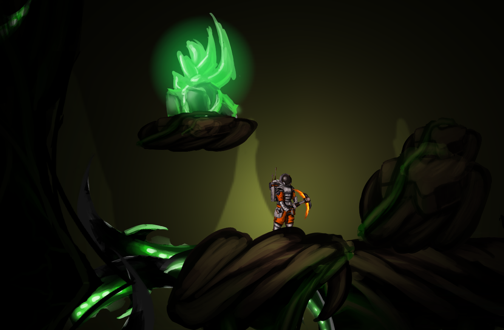
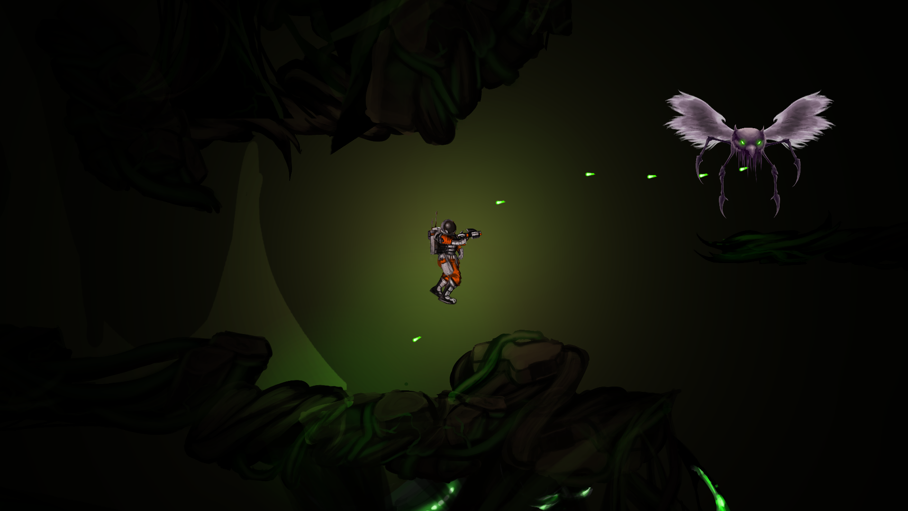

### Freezing Goats
#### No price but lots of fun

Inspired by the so called fainting goats we made a multiplayer party game called [Freezing Goats](https://github.com/Niodith/Portfolio/tree/master/GameBuilds/FreezingGoats.zip "Freezing Goats") which was solely based on the idea to have as much fun as possible.
You are fighting your co-goats to get as high as possible and yeet each other into space - with super wiggly rigid bodies to laugh as much as possible.
Apart from my usual role as last minute bug fixer I was mainly responsible for the main concept and the controller programming to support diffrent kind of input devices.

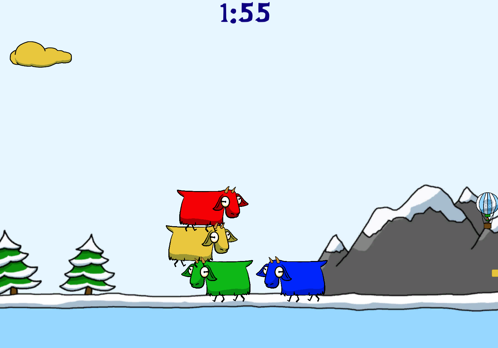

### Flappy Bird 2.0
#### Theme: Nightmare - honorable mention

It starts as a simple Flappy Bird style game - and you get pushed into a coders deepest fear - a nightmare where you are only able to escape when you _fix_ your code.

I did parts of the shader and designed the riddles you have to solve to escape the nightmare.

You can find the trailer for this game [here](https://www.youtube.com/watch?v=cWZ3SMBPXlU&ab_channel=ShyTeaGames "here").

And the running game (with some very nice polishes from Seb) [here](https://shytea.itch.io/flappybird2 "here") on itch.io.

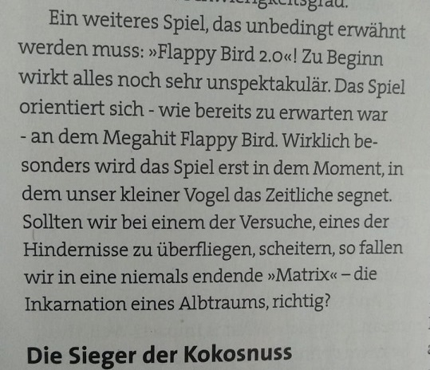
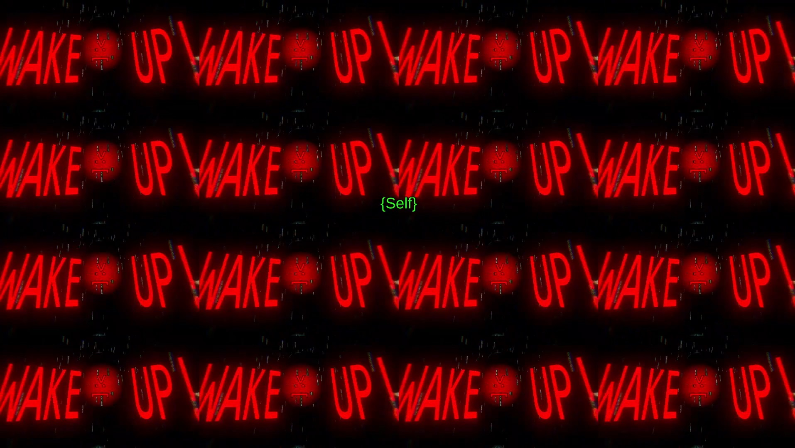
